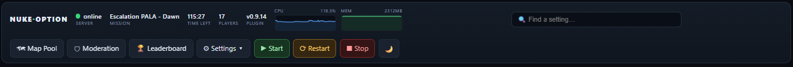
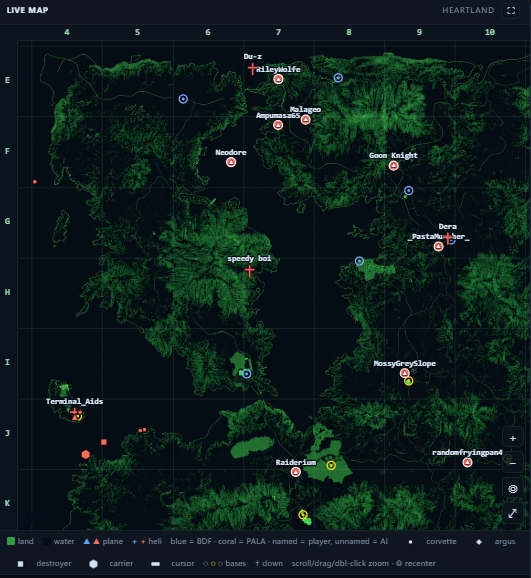
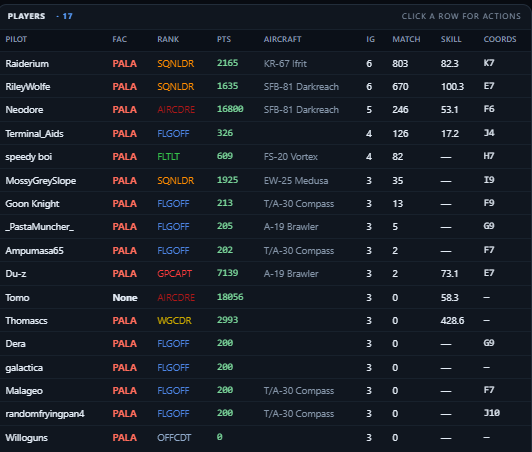
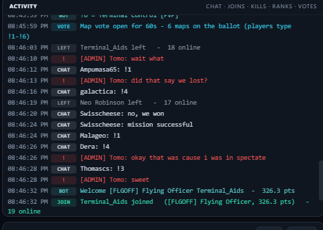

# Nuke-Option — Community Server Toolkit

A toolkit for running a Nuclear Option dedicated server with more to offer your players. It adds persistent ranks, skill-based team balancing, moderation, performance limits, and a live battle map you run from your browser.

It's three parts that work together: a server-side **plugin** (BepInEx/Harmony), a **bot** on your PC, and a **web command centre** in your browser. They talk through the game log, a relay, and shared files, so any one can restart without taking the others down.

> 💬 **Questions or ideas?** Join the community on **[Discord](https://discord.gg/B46h4Dd7uj)**. Suggestions and feedback are welcome.

## ⬇️ Download — pick your server type

Each download is a ready-to-go folder with everything inside: BepInEx, the NukeStats plugin, every built-in mission plus the extra maps we've tested on our dev server, the bot, and the web command centre. Grab the one that matches how your server is hosted, unzip it, and run the installer inside. The installer asks for your details (each field explains **what it is** and **where to find it**) and wires everything up.

> **Which is tested?** ✅ **Pterodactyl is working and tested end-to-end.** ⚠️ The **Local** (own-PC) and **Manual** (drag-and-drop) options are built but only lightly tested. They should work, but expect rough edges, and please report anything that doesn't.

| Your setup | Status | Download | What you do |
|---|---|---|---|
| **Pterodactyl panel** (hosted Linux) | ✅ Working | **[⬇ Pterodactyl bundle](https://github.com/TomosBombos/nuclear-option-toolkit/releases/latest/download/nuclear-option-toolkit-pterodactyl.zip)** | Unzip, run `install.bat` (or `./install.sh`), enter your panel's SFTP and API details. It pushes the plugin, missions, and config over SFTP and makes the server boot modded. Then launch the bot and dashboard. |
| **Your own PC** (Windows / Linux) | ⚠️ Beta (lightly tested) | **[⬇ Local bundle](https://github.com/TomosBombos/nuclear-option-toolkit/releases/latest/download/nuclear-option-toolkit-local.zip)** | Unzip, run `install.bat`. It installs the dedicated server with SteamCMD, copies the toolkit in, and launches server, bot, and dashboard together. |
| **Hosting by hand / other** | ⚠️ Beta (lightly tested) | **[⬇ Manual bundle](https://github.com/TomosBombos/nuclear-option-toolkit/releases/latest/download/nuclear-option-toolkit-manual.zip)** | Unzip, follow `README.md` to drop the files into place (both BepInEx packs are included). The installer writes your config. |

> All downloads live on the **[Releases page](https://github.com/TomosBombos/nuclear-option-toolkit/releases/latest)**.

### How to run the installer

1. **Install Python 3.8+** if you don't have it: <https://www.python.org/downloads/>. On Windows, tick **"Add python.exe to PATH"** in the installer.
2. **Download** the ZIP for your server type (above) and **unzip it** anywhere.
3. **Run the installer** from inside the unzipped folder:
   - **Windows** — double-click **`install.bat`**
   - **macOS / Linux** — run **`./install.sh`** in a terminal
   - *(Either way it runs `python installer/setup.py`. You can run that directly too.)*
4. A **wizard opens in your browser**. Work through it. Every field explains what it is and where to find it. Then it wires everything up and you launch your server and dashboard.

That's it. Nothing installs globally, and there's no config to hand-edit. The wizard does it all. (Cloning the repo instead of downloading a bundle? See **[Get started](#get-started)** below.)

## What it does

- **Ranks & economy** — Lifetime ranks that reward time and scoring. Play and score across matches to climb an 11-rank ladder. Points come from your real in-game score plus win, placement, and kill bonuses. The bot owns the data and backs it up daily.
- **NuclearSkill** — A separate skill rating for how well you fly: scoring on a sortie and getting home without being shot down. It's what team balance uses, not your rank. Check it with `!skill`.
- **Team balance (PvP)** — Keeps PvP sides even. It protects new joiners and `!squadup` groups, and moves the player who best evens out the skill between teams.
- **Anti-grief & moderation** — Automated teamkill punishment (warn → kick → ban), bans, vote-kick, and a network flood guard that stopped a recurring match-start mass-disconnect.
- **AI limiter** — Caps AI aircraft and clears stuck ones to protect framerate. It only ever removes AI, never players.
- **Live map & command centre** — A pan/zoom battle map with player, AI, and ship blips. Change maps, schedule restarts, control server power, and edit any plugin setting live.
- **More** — Map voting, chat rank tags, a slur filter, forfeit votes, a server-message manager, PvE timeout rules, and an opt-in public server directory.

→ Full tour, feature by feature: **[docs/FEATURES.md](docs/FEATURES.md)**

## Preview — the web command centre

One browser tab runs the whole server: live map, kill feed, ranks and skill, chat, console, map voting, scheduling, and power.



<p align="center">
  
  &nbsp;
  
  &nbsp;
  
</p>

<sub>▶ <b><a href="docs/preview/full.png">See the full dashboard</a></b></sub>

## Documentation

| Doc | What it covers |
|---|---|
| **[docs/FEATURES.md](docs/FEATURES.md)** | Every feature and setting, and what each is for |
| **[docs/COMMANDS.md](docs/COMMANDS.md)** | Every command and tool: players, admins, the web console, the CLI |
| **[docs/MODERATION.md](docs/MODERATION.md)** | Teamkill enforcement, anti-grief auto-kick, bans, vote-kick, reports |
| **[docs/ARCHITECTURE.md](docs/ARCHITECTURE.md)** | How the three parts fit together — overview up top, deep technical reference below |
| **[SECURITY.md](SECURITY.md)** | Update signing (minisign) and the credentials stance |
| **[CHANGELOG.md](CHANGELOG.md)** | What changed in each release |

## Get started

**1. Install the prerequisites** — you need **Python 3.8+**, the **paramiko** package, and (to clone) **Git**.

<details>
<summary><b>Windows</b></summary>

1. **Python** — open <https://www.python.org/downloads/>, click **Download Python 3.x**, run the
   installer, and on the first screen **tick "Add python.exe to PATH"**, then **Install Now**.
   Open a *new* PowerShell window and check: `python --version`.
2. **paramiko** (needed for the external / SFTP options): run `pip install paramiko`
   (if `pip` isn't found, use `python -m pip install paramiko`).
3. **Git** (for cloning — skip if you use *Download ZIP* below) — install from
   <https://git-scm.com/download/win>, accept the defaults. Check: `git --version`.
</details>

<details>
<summary><b>macOS</b></summary>

```bash
brew install python git      # or get Python from python.org and Git via: xcode-select --install
pip3 install paramiko
python3 --version && git --version
```
</details>

<details>
<summary><b>Linux (Debian/Ubuntu)</b></summary>

```bash
sudo apt update && sudo apt install -y python3 python3-pip git
pip3 install paramiko
python3 --version && git --version
```
</details>

> Use `python` / `pip` on Windows, and `python3` / `pip3` on macOS and Linux.

**2. Download the toolkit**

With git:
```bash
git clone https://github.com/TomosBombos/nuclear-option-toolkit.git
cd nuclear-option-toolkit
```
No git? On this page click the green **`< > Code ▾` → Download ZIP**, extract it, and open a
terminal in the extracted folder.

**3. Run the guided installer** (the toolkit source lives in [`src/`](src))
```bash
python src/installer/setup.py
```
(On Windows you may need `py src\installer\setup.py`.) A wizard opens in your browser. It checks
prerequisites, asks where your server runs, takes your connection details, sets a few options, and
writes a clean config. **Your credentials stay on your machine and never enter the repo.**
More detail: **[src/installer/README.md](src/installer/README.md)**.

> Prefer to wire it up by hand? In `src/`, copy `run.bat.example` → `run.bat`,
> `apiKey.txt.example` → `apiKey.txt`, `panel.txt.example` → `panel.txt`, fill in your values,
> then run `run.bat`.

> **Building the plugin from source** needs the game's managed assemblies
> (`src/NukeStats/libs/`), which you supply from your own game install. They are not
> distributed here.

> ⚠️ **Early and iterating.** The guided installer is under active development. If a step doesn't
> complete end-to-end on your setup, the manual path above works. Please
> [open an issue](https://github.com/TomosBombos/nuclear-option-toolkit/issues) with what you hit
> so we can harden it.

## Updating

You're never auto-updated. You update when *you* want to. Two ways:

### Easy way — re-download and re-run the installer

1. **Download the latest stable** for your server type:
   - ⬇ **[Pterodactyl](https://github.com/TomosBombos/nuclear-option-toolkit/releases/latest/download/nuclear-option-toolkit-pterodactyl.zip)**
   - ⬇ **[Local](https://github.com/TomosBombos/nuclear-option-toolkit/releases/latest/download/nuclear-option-toolkit-local.zip)**
   - ⬇ **[Manual](https://github.com/TomosBombos/nuclear-option-toolkit/releases/latest/download/nuclear-option-toolkit-manual.zip)**
   - *(These links always point at the current **stable**. All versions: the [Releases page](https://github.com/TomosBombos/nuclear-option-toolkit/releases/latest).)*
2. **Unzip it.**
3. **Run the installer again** — `install.bat` (Windows) or `./install.sh` (macOS/Linux). It re-deploys the new plugin and bot and restarts. Your config, ranks, and settings are kept.

### In-place way — pull just the changed files (no re-download)

Run these from a terminal opened **inside your toolkit folder** — the one that contains
`install.bat`, the `installer` folder, and `START EVERYTHING.bat`.
*(On Windows: open that folder in File Explorer, click the address bar, type `powershell`, press Enter. That opens a terminal already in the folder.)*

1. **See what's available** on your channel:
   ```
   python installer\updater.py check
   ```
2. **Download, verify, and stage** it (it checks the SHA-256 and the signature before staging anything):
   ```
   python installer\updater.py update --component all
   ```
3. **Apply it.** Nothing on your server changes until this step:
   - **Plugin** — deploy it with `run.bat --deploy-plugin` (Pterodactyl/external; `run.bat` is in this same folder), or just restart your server (local PC).
   - **Bot** — install the new bot file:
     ```
     python installer\updater.py update --component bot --apply
     ```
     then **restart the bot so it loads the new version** — double-click **`START EVERYTHING.bat`** in this folder (or close the bot's window and run it again).

*(macOS/Linux: use `/` instead of `\`. From a git clone rather than a downloaded bundle, the path is `src/installer/updater.py`.)*

**Channel:** in `~/.nuke-option-toolkit/config.json` set `update.channel` to `"stable"` (default,
polished releases) or `"nightly"` (latest build, less tested). Every download is signature-checked
before it can be applied. See **[SECURITY.md](SECURITY.md)**.

## Community Servers

Servers running the toolkit that have opted into the public directory. Nuclear Option has no
direct-connect, so find them by **name** in the in-game server browser. This list updates every hour.

<!-- COMMUNITY-SERVERS:START -->
_Loading the live list…_ &nbsp; ([full directory ↗](https://tomosbombos.github.io/nuclear-option-servers/))
<!-- COMMUNITY-SERVERS:END -->

**Running a server?** Turn on *List Server Publicly* in the command centre's settings to appear here.
Only your server's name, region, and plugin version are published, never your IP. Setup steps:
[docs/SERVERS.md](docs/SERVERS.md).

## 💬 Community & feedback

Got an idea, a feature request, or just want to talk about running a server?
**[Join the Discord](https://discord.gg/B46h4Dd7uj)**. Suggestions and feedback are welcome. You can
also [open an issue](https://github.com/TomosBombos/nuclear-option-toolkit/issues) for bugs or
concrete proposals.

## License

See [`LICENSE`](LICENSE) — GPL-3.0-or-later.

## Planned features

On the roadmap. Not built yet, but where the toolkit is headed:

- **Config-file setup without the web command centre** — configure the plugin and bot entirely from a config file, for people who already run their own server and just want the plugin and bot.
- **Multiple plugins at once** — let the launcher load and manage several plugins on a server at the same time, not only the toolkit's own.
- **Everything customisable** — make every feature configurable, not only the ones surfaced today.
- **Ongoing polish** — keep refining the UI and making the whole toolkit easier to pick up.
</content>
